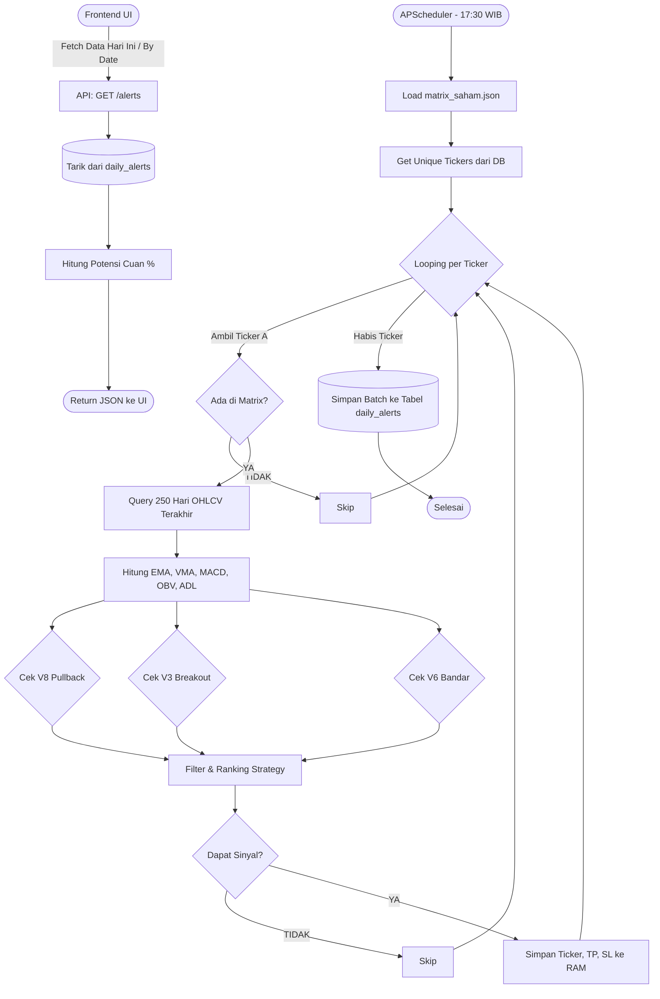

# Alur Kerja Sistem Daily Alert (SwingMaster AI)

Dokumen ini menjelaskan secara rinci bagaimana **Alert Engine** (`AlertEngine.py`) bekerja di belakang layar untuk mencari sinyal trading secara otomatis, serta bagaimana sinyal tersebut disajikan melalui API (`alerts.py`).

---

## ⚙️ 1. Siklus Background (AlertEngine.py)

Proses utama pencarian sinyal dilakukan oleh fungsi *asynchronous* `run_daily_alerts()` yang berjalan secara otomatis atau bisa dipanggil secara manual.

### Tahap 1: Inisiasi & Persiapan Data
1. **Trigger Scheduler**: Setiap Senin-Jumat pukul 17:30 WIB, `APScheduler` di `main.py` akan memanggil fungsi `run_daily_alerts()`. Waktu ini dipilih karena market sudah tutup (EOD), sehingga harga *closing* sudah valid.
2. **Load Konfigurasi Matrix**: Engine akan membaca file `matrix_saham.json` untuk mengetahui daftar saham apa saja yang di-cover beserta urutan peringkat strateginya (Peringkat 1, 2, 3).
3. **Ambil Ticker Valid**: Melakukan koneksi ke `market_data.db` dan mengambil seluruh daftar `ticker` unik dari tabel `daily_prices`.

### Tahap 2: Ekstraksi Data Historis (Per-Ticker)
Sistem akan melakukan perulangan (looping) untuk setiap ticker. Di dalam loop ini:
1. Jika ticker tidak ada di dalam `matrix_saham.json`, maka sistem akan **skip** ticker tersebut.
2. Jika ada, sistem akan melakukan *query* menarik **250 hari data transaksi terakhir** (OHLCV) dari tabel `daily_prices`.
   > [!NOTE]
   > Mengapa 250 hari? Meskipun kita hanya mengecek sinyal di hari terakhir, perhitungan indikator seperti **EMA 200** membutuhkan setidaknya 200 hari data agar nilainya benar dan akurat, tidak bias karena data yang terlalu sedikit.
3. Data di-sorting secara kronologis (dari masa lalu ke hari ini) menggunakan library `pandas`.

### Tahap 3: Kalkulasi Indikator Teknikal
Data mentah dilempar ke fungsi `calculate_indicators()`. Sistem melakukan operasi *vectorized* yang sangat ringan & cepat untuk menghitung:
- **Trend/Support**: `EMA 20`, `EMA 200`
- **Volume**: `VMA 20` (Volume Moving Average 20)
- **Momentum**: `MACD`
- **Akumulasi Bandar**: `OBV` (On-Balance Volume) & EMA-nya, serta `ADL` (Accumulation/Distribution Line) & EMA-nya.
- **Data H-1**: Data penutupan kemarin (`close_prev`, `EMA_20_prev`, dll) disiapkan untuk mengecek validasi penembusan harga (*breakout*).

### Tahap 4: Filter Strategi & Penentuan Sinyal
Data yang sudah matang dilempar ke fungsi `check_strategies()`. Di sini, baris terakhir (hari ini) diuji apakah masuk kriteria dari 3 strategi utama:
- **V8_Pullback**: Syarat `Close > EMA 200`, candle menyentuh support `EMA 20` (`Low <= EMA 20` dan `Close >= EMA 20`), harga koreksi (`Close < Close_prev`), dan volume sepi (`Volume < VMA 20`).
- **V3_Breakout**: Syarat lonjakan volume (`Volume >= 2 * VMA 20`), harga menembus resistance (`Close > EMA 20` padahal kemarin di bawahnya), dan MACD yang menanjak.
- **V6_Bandar**: Syarat harga di atas `EMA 200`, menempel `EMA 20`, serta indikator akumulasi solid (`OBV > OBV EMA 20` dan `ADL > ADL EMA 20`).

**Logic Penentuan Sinyal (Ranking System):**
Jika satu saham memenuhi lebih dari satu strategi (misal tembus V8 dan V6 secara bersamaan), engine **TIDAK** akan menghasilkan dua buah alert untuk saham yang sama. 
Sistem akan mengecek peringkat strategi pada `matrix_saham.json` untuk ticker tersebut (mana yang peringkat 1, 2, atau 3). Sistem hanya akan menghasilkan sinyal untuk strategi yang memiliki **peringkat tertinggi** yang terpenuhi (Return pertama yang match).

Jika lolos, engine mencatat:
- **Entry Price**: `Close` hari ini
- **Target Price**: Entry + 5%
- **Stop Loss**: Entry - 5%

### Tahap 5: Simpan ke Database
Setelah semua ticker selesai dilooping, seluruh sinyal yang ditemukan dikumpulkan dan di-insert sekaligus (menggunakan `executemany` untuk mengefisiensi koneksi I/O DB) ke tabel `daily_alerts` dengan `signal_date` menggunakan tanggal hari ini, lalu status di-set menjadi `"open"`.

---

## 🌐 2. Penyajian Data (alerts.py)

API ini bertugas mengolah dan melayani permintaan dari UI Frontend agar data bisa dibaca oleh pengguna.

Terdapat 2 Endpoint Utama:
1. **`GET /alerts/dates`**:
   - Sistem melakukan query `SELECT DISTINCT signal_date` dari tabel `daily_alerts`.
   - Menghasilkan daftar tanggal-tanggal unik yang punya history alert (Berguna untuk *dropdown* kalender riwayat UI).

2. **`GET /alerts/?date=YYYY-MM-DD`**:
   - Jika `date` **TIDAK dikirim**: Sistem akan mencari data alert pada hari ini (today) **ATAU** alert dari hari-hari sebelumnya yang statusnya masih `"open"`.
   - Jika `date` **DIKIRIM**: Sistem akan bertindak sebagai "History View", yaitu hanya mengembalikan baris-baris dari tanggal spesifik tersebut secara eksklusif.
   - **Real-Time Kalkulasi**: Untuk setiap alert yang ditarik dari DB, API melakukan hitungan langsung *Potensi Cuan %* secara on-the-fly: `((Target Price - Price at Signal) / Price at Signal) * 100`. Nilai ini kemudian dikirim sebagai format JSON ke Frontend.

---

## 📊 Diagram Alur (Flowchart)

